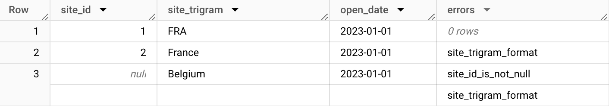
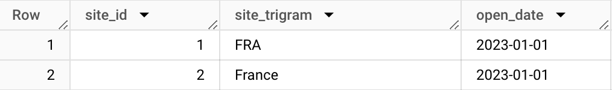

### Create the assertions you want on your table

The `d_site` table is defined as follows:

```yml
version: 2

models:
  - name: basic_example
    columns:
      - name: site_id
      - name: site_trigram
      - name: open_date
      - name: errors
        assertions:
          site_id_is_not_null:
            description: 'Site ID is not null.'
            expression: site_id IS NOT NULL

          site_trigram_format:
            description: 'Site trigram must contain 3 upper digits'
            expression: |
              LENGTH(site_trigram) = 3
              AND site_trigram = UPPER(site_trigram)
```

Assertions are set under the `errors` columns (can be changed).

### Generate assertions results during run-time

Once the assertions described, you can call the `dbt_assertions.assertions()` macro as follows.

```sql
{{
    config(alias='d_site', materialized='table')
}}

WITH
    final AS (
        SELECT 1 AS site_id, 'FRA' AS site_trigram, DATE('2023-01-01') AS open_date
        UNION ALL
        SELECT 2 AS site_id, 'France' AS site_trigram, DATE('2023-01-01') AS open_date
        UNION ALL
        SELECT NULL AS site_id, 'Belgium' AS site_trigram, DATE('2023-01-01') AS open_date
    )
SELECT
    *,
    {{ dbt_assertions.assertions() | indent(4) }},
FROM `final`
```

Everything works fine ! 🔥🔥🔥

### Easy data quality evaluation



All the failed assertions are saved under the `errors` columns which is an array of string containing failed assertions ID.

### Filter bad data in your downstream models

```sql
{{
    config(alias='downstream_model', materialized='table')
}}

SELECT
    site_id,
    site_trigram,
    open_date,
FROM {{ ref('basic_example_d_site') }}
-- Remove bad data: here only sites without ID.
WHERE {{ dbt_assertions.assertions_filter(blacklist=['site_id_is_not_null']) }}
```




### Combine assertions & generic tests

#### Example usage

Suppose we are working with the `d_site` table - you want to use generic tests.

Configure the generic test in schema.yml with:

```yml
model:
  name: my_model
  tests:
      - dbt_assertions.generic_assertions:
          from_column: <column_name>
          whitelist: [list(str_to_filter)]
          blacklist: [list(str_to_filter)]
          re_assert: true | false

  columns:
    ...
```

Note: 'generic_assertions()' is the name given to the test in 'tests/generic' - you can change its name if needed.

For instance, the blacklist argument will filter all rows containing at least a "key_1_not_null" error:

```yml
model:
  name: my_model
  tests:
      - dbt_assertions.generic_assertions:
          from_column: 
          whitelist:
          blacklist: ["key_1_not_null"]
          re_assert:

  columns:
    ...
    assertions:
      key_1_not_null:
        description: "key_1 is not null."
        expression: "key_1 IS NOT NULL"

      key_2_not_null:
        description: "key_2 is not null."
        expression: "key_2 IS NOT NULL"
```

You can also use the whitelist & from_columns arguments, or use the function without arguments (and thus filtering).